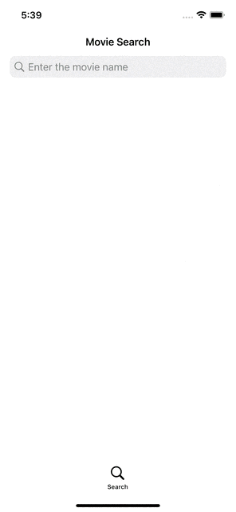
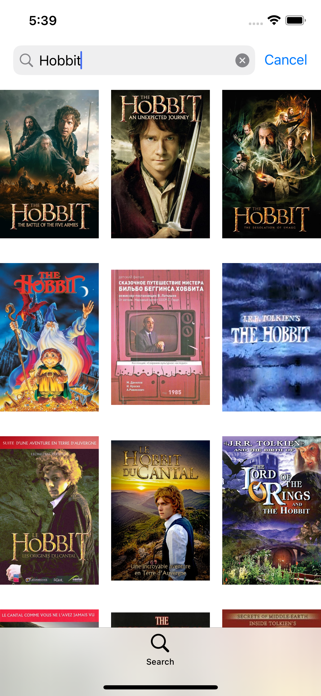

# UISearchControllerTest

## Overview

a SearchController test app that searches for movies in the TMDB database using the API and displays them in collection views.

## Installation

1. Clone or download the repository to your local machine.
2. Open the <span style="color:red ">*SearchControllerTest.xcodeproj*</span> file in Xcode.
3. Select a simulator or a physical device to run the app on.Click the "Run" button in Xcode to build and run the app.
4. The app uses SDWebImage to store image data with Swift Package Manager. If you see that it is not installed, install it from that address: https://github.com/SDWebImage/SDWebImage.git
5. Don't forget to change the API key in the Services/ApiService.swift file to your own key.

```swift
static let apiKey = "TMDB_API_KEY"
```

## GIF

<div>

</div>


## Screenshots

<div>


</div>

## Features

- AutoLayout without StoryBoard
- TMDB API
- SDWebImage
- MVVM 
- CollectionView and UISearchController


## Todo

- It is flexible because TabBarController is used.


